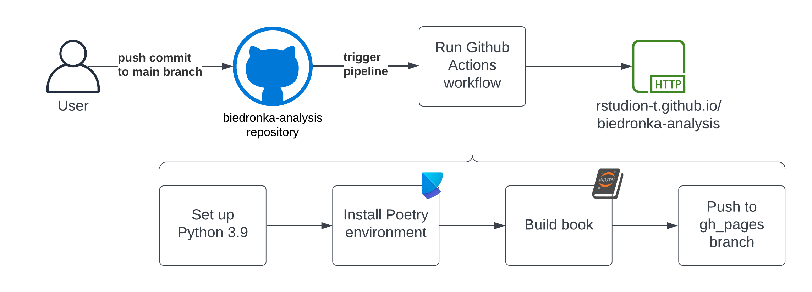

# Wdrożenie raportu

Projekt został opracowany w języku programowania **Python** z wykorzystaniem biblioteki **Jupyter** do tworzenia notebooków. 

Raport został opublikowany w oparciu o narzędzie [Jupyter book](https://github.com/executablebooks/jupyter-book) oraz [Github Pages](https://pages.github.com/).

## Diagram wdrożenia



Projekt wykorzystuje workflow **Github Actions** do automatyzacji procesu wdrożenia. Przy każdej zmianie w repozytorium na gałęzi `main` uruchamiany jest proces budowania raportu, który następnie jest publikowany na gałęzi `gh-pages` i dostępny pod adresem [https://rstudion-t.github.io/](https://rstudion-t.github.io/).

Do zarządzania zależnościami wykorzystano narzędzie **Poetry**.

Workflow został zdefiniowany w pliku [`.github/workflows/deploy.yml`](https://github.com/rstudion-t/biedronka-analysis/blob/main/.github/workflows/publish-book.yaml):

```yaml
name: deploy-book

on:
  push:
    branches:
      - main

permissions:
  contents: write
  pages: write
  id-token: write

jobs:
  deploy-book:
    runs-on: ubuntu-latest
    steps:
    - uses: actions/checkout@v2

    - name: Set up Python 3.9
      uses: actions/setup-python@v2
      with:
        python-version: 3.9

    - name: Install dependencies
      run: |
        python -m pip install --upgrade pip
        pip install poetry==1.7.1
        poetry install --no-root

    - name: Build the book
      run: |
        poetry run jupyter-book build --path-output ./ rstudion-t/

    - name: GitHub Pages action
      uses: peaceiris/actions-gh-pages@v3.6.1
      with:
        github_token: ${{ secrets.GITHUB_TOKEN }}
        publish_dir: ./_build/html
```

```{note}
Dla domyślnego darmowego planu Github Team, Github Pages dostępne jest tylko dla repozytoriów publicznych.
```
